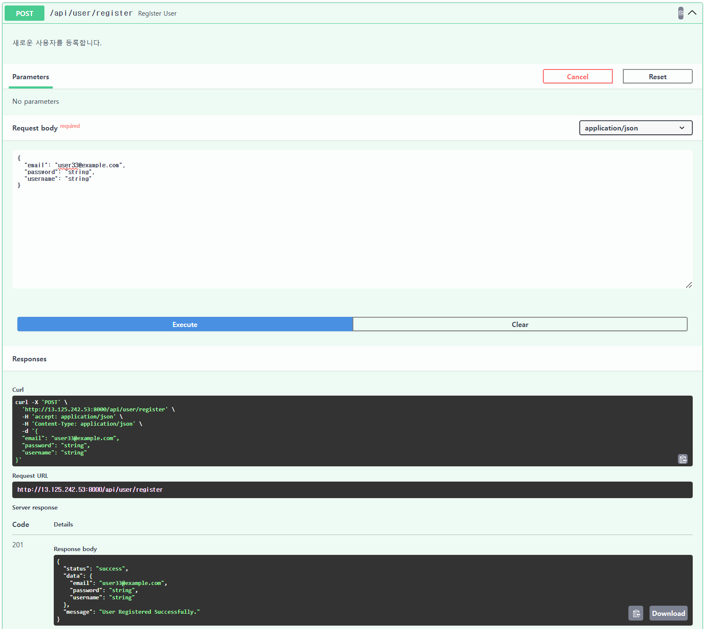
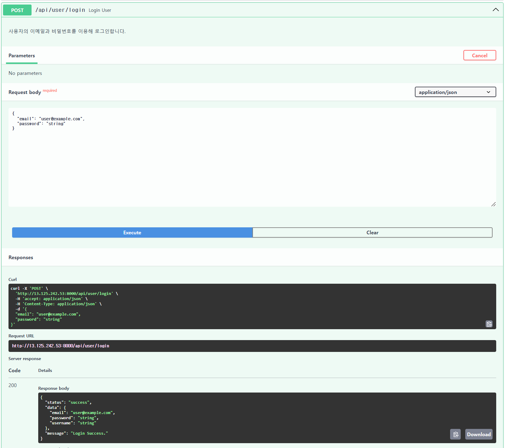
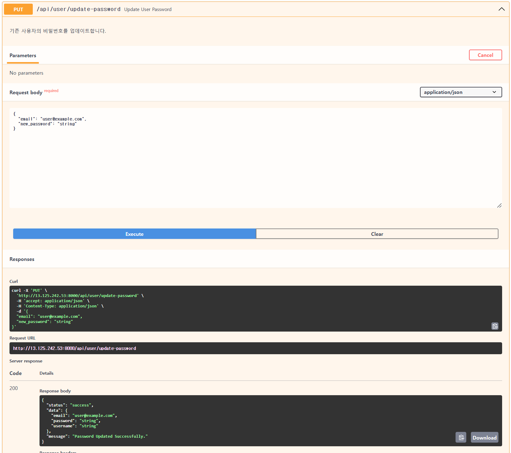
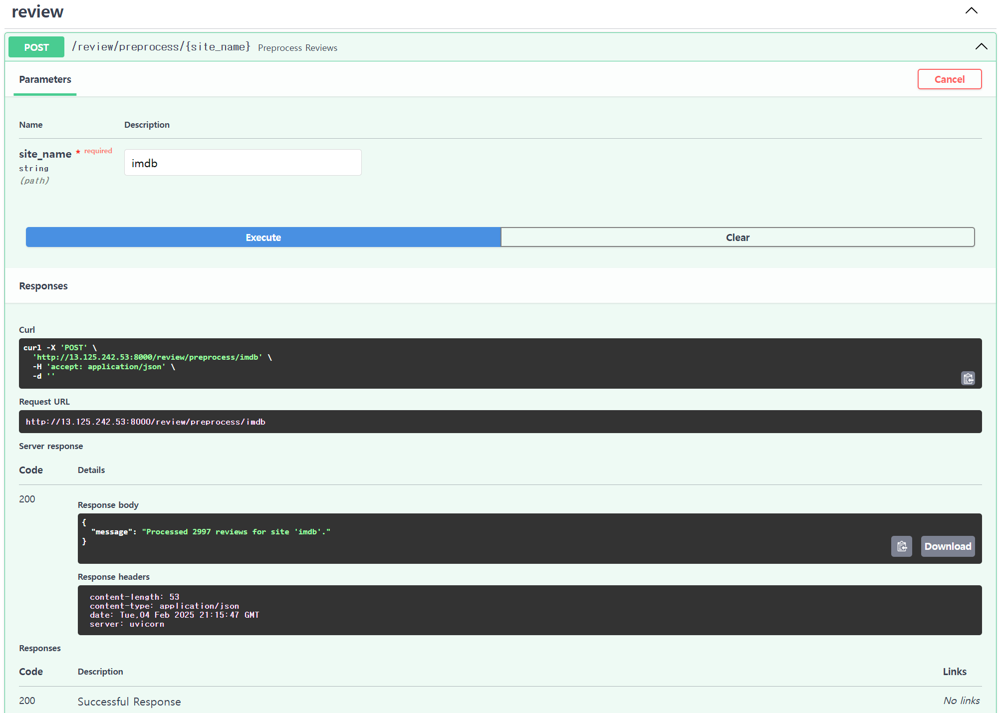
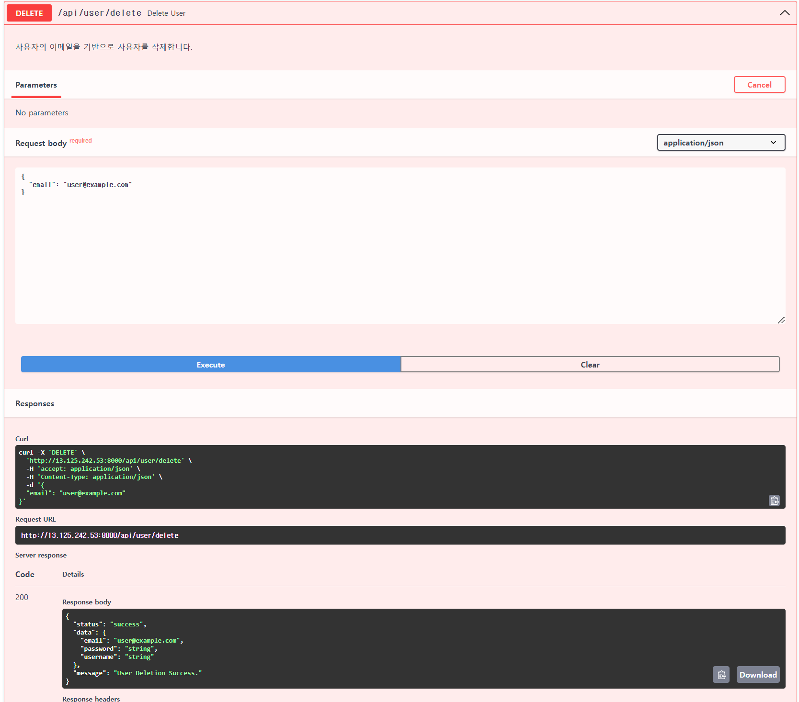
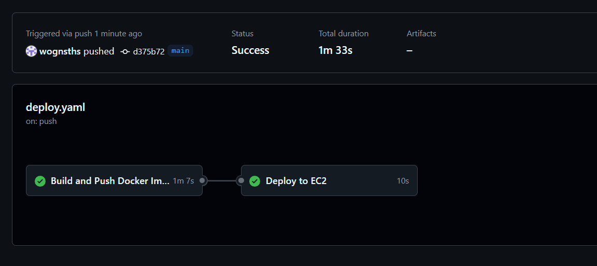

# YBIGTA_newbie_team_project

## 팀소개
안녕하세요! 6조입니다!!! 화이팅화이팅~~

## 팀원 소개

| **손재훈(조장)**          | **김이지**                   | **신소연**              |
|:-------------------------:|:---------------------------:|:-----------------------:|
| 00년생 응용통계학과 21학번 | 01년생 컴퓨터과학과 20학번 | |
| 반갑습니다! 잘 부탁드립니다~ | 잘 부탁드립니다! |  |

## 사진

#### branch_protection.png

#### push_rejected.png

#### merged_손재훈.png

#### merged_김이지.png

#### merged_신소연.png

## app 프로젝트 실행 방법

1. 가장 상위 폴더 디렉토리로 이동
2. 필요한 라이브러리 설치 : pip install -r requirements.txt 
3. 실행 : uvicorn app.main:app --reload
4. 웹 브라우저를 켜서 : http://127.0.0.1:8000/static/index.html
5. 기능 살펴보기

## crawling 데이터 정보

#### 영화 : 기생충
1. 네이버 영화 리뷰(국내)
    - 크롤링한 사이트의 링크 : "https://search.naver.com/search.naver?query=영화%20기생충%20관람평"
    - columns(데이터 형식) : review_type(str), sort_type(str), writing_date(str), star_rating(str), comment(str), upvote(int), downvote(int)
    - 개수 : 1092개

2. IMDB 영화 리뷰(해외)
    - 크롤링한 사이트의 링크 : "https://www.imdb.com/title/tt6751668/reviews/?ref_=tt_ururv_sm"
        - 스포일러 리뷰는 모두 제거하고 가져옴
    - columns(데이터 형식) : star_rating(int),title(str),content(str),date(str)의 컬럼으로 구성됨
    - 개수 : 2977개

## crawling code 실행 방법
1. 터미널 위치를 crawling 폴더로 이동
2. python main.py -o ../../database --all

## EDA

1. 분포 파악
- 네이버와 IMDB 리뷰의 평점 분포 파악

네이버와 imbd 모두에서 U-shape의 분포를 띄고 있어 공통적으로 평점 시스템이 다소 극단화되어 있는 것을 확인할 수 있습니다. 네이버 리뷰의 경우 그 경향이 더 짙은데, 왜냐하면 8, 9점 리뷰의 비율이 IMDb에 비해 낮기 때문입니다.

- 네이버와 IMDB 리뷰의 텍스트 길이 분포 파악

로그 변환을 했음에도 IMDb의 텍스트 길이가 네이버에 비해 높은 것을 알 수 있습니다. 텍스트를 직접 비교했을 때도 실제로 IMDb의 리뷰는 주장과 근거의 측면에서 "문장"의 짜임새가 더욱 부각되었습니다.

- 날짜 분포 파악

IMDb의 경우 요일과 리뷰 개수와의 상관관계가 유의미하다고 말할 수 없습니다. 반면 네이버 리뷰의 경우 목요일에 리뷰의 수가 많은데, 수요일이 "문화인의 날"이라서 그 다음 날짜인 목요일에 평론이 많을 수 있다는 추측을 할 수 있습니다. 그러나 리뷰 작성률이 서비스 이용 시간이 지날수록 줄어든다는 통념을 생각하면, 이 결과에 대한 추가 조사가 필요합니다.

   
2. 이상치 파악
   - 별점 범위 벗어난 값
     
     별점 범위를 벗어난 값이 수집되지 않아 존재하지 않습니다.
     
   - 비정상적으로 길거나 짧은 리뷰
     
     너무 짧은 성의없는 리뷰는 제거되었습니다. IMDB에서 매우 긴 리뷰가 소수 발견되었지만 이상치로 판단하지 않고 삭제하지 않았습니다.
     
   - 기간 이상치 파악
     
     모두 2019~2024년의 적절한 기간 안의 데이터로 구성되어있습니다.

## 데이터 전처리/FE

1. 네이버 영화 리뷰
   - 결측치 처리
     
     내용이 존재하지 않는 경우의 데이터를 제거합니다.

   - 이상치 처리
     
     리뷰 글자 수가 평균 + 2.5 * 표준편차를 초과하는 경우 이상치로 간주하였습니다.
     이상치인 경우 문장 중에서 가장 긴 문장만 남겼습니다.
     
   - 텍스트 데이터 전처리
     
     불용어(ㅋㅋㅋ 등) 제거를 진행했습니다.
     숫자 관련 데이터(15세, 19세 등)은 관람 등급에 대한 언급과 연관이 높아 보존하였습니다.

   - 파생 변수 1가지 이상 생성
     
     1. 날짜에 대한 요일 값
     2. 리뷰 데이터에 대한 5가지 카테고리 분석
     - 학습된 sentence transformer 모델을 사용하여 리뷰 데이터를 임베딩 변환하였습니다.
     - 사전에 정의된 카테고리(영화의 평가에 관한 카테고리: Masterpiece, Social Commentary, Suspense & Thrill, Overrated, Uncomfortable)와 관련된 문장 벡터화했습니다.
     - 각 리뷰와 카테고리 벡터 간 코사인 유사도 계산하여 해당 리뷰가 어느 카테고리에 속하는지 확인할 수 있도록 하였습니다.
   
   - 텍스트 벡터화
     
     - 이미 학습된 언어 모델로 리뷰 문장에 대한 벡터화 진행 했습니다.
     - distiluse-base-multilingual-cased-v2
     - https://huggingface.co/sentence-transformers/distiluse-base-multilingual-cased-v2

1. IMDB 영화 리뷰
   
    - 결측치 처리  
      IMDB 영화 리뷰 데이터의 평점(`star_rating`) 컬럼은 크롤링 시 평점이 없는 데이터를 제외하고 수집하였기 때문에 결측치가 존재하지 않습니다.  
      나머지 컬럼(예: `리뷰 내용`, `작성자`, `작성일`)에 대해서도 데이터 검증을 진행한 결과 결측치가 발견되지 않았습니다.  
    
    - 이상치 처리  
      `본문` 컬럼의 경우, 리뷰의 질을 확보하기 위해 지나치게 짧은 리뷰(5글자 이하)를 이상치로 간주하고 제거하였습니다.  
      또한, `star_rating` 컬럼은 1에서 10까지의 정상 범위 내에 있는지 확인하였으며, 이상치가 존재하지 않음을 확인하였습니다.  
    
    - 텍스트 데이터 전처리  
      리뷰의 본문(`리뷰 내용`) 데이터를 분석하기 위해 다음과 같은 전처리 작업을 수행하였습니다.  
      1. 모든 텍스트 데이터를 **소문자 변환**하여 일관성을 유지.  
      2. 의미 없는 단어(불용어, stopwords)를 제거하여 분석의 정확도를 높임.  
         - 특히, `movie`, `parasite`, `film` 등 문서에 자주 등장하지만 의미가 없는 단어를 추가적으로 제거.  
      3. **특수문자 및 숫자 제거**를 통해 텍스트를 정제.  
      4. 날짜 데이터(`date` 컬럼)는 기존 `str` 형식에서 Python의 `datetime` 객체로 변환하여 분석에 용이하도록 처리.  
    
    - 파생 변수 생성  
      날짜 컬럼(`date`)을 활용하여 요일(`day_of_week`) 컬럼을 새롭게 생성하였습니다.  
      이를 통해 요일별 리뷰 패턴을 분석할 수 있도록 하였습니다.  
    
    - 텍스트 벡터화  
      리뷰 본문 데이터를 분석하기 위해 **TF-IDF(단어 빈도-역문서 빈도)** 기법을 적용하였습니다.  
      이를 통해 각 리뷰의 텍스트 데이터를 수치화하고 분석에서 활용할 수 있도록 변환하였습니다.  

## 시각화
(비교분석 그래프에 대한 그래프와 설명)

##### 텍스트 비교 분석

### 1. 네이버 영화 리뷰
- 평점 5 이상의 리뷰에 대한 텍스트 빈도

- 평점 5 이하의 리뷰에 대한 텍스트 빈도

- 전체 평점에 대한 텍스트 빈도

- 자주 등장하는 키워드에 대한 평점 분포

#### 결론

- 평점이 5점보다 낮은 리뷰의 텍스트에 비교하여 "생각" 단어가 대표어가 되었음을 확인할 수 있습니다. 평점이 높게 나온 리뷰들 중에서 "생각을 많이 하게 되는"과 같은 수식어가 많이 나온 것이 요인으로 볼 수 있을 것입니다.
또한 평점이 높은 리뷰 중 배우의 연기, 연출 등 영화적 장치에 대한 호평을 다룬 리뷰들을 상당수 확인할 수 있었습니다.

- 반면 평점이 낮은 리뷰의 경우 이 영화가 칸 영화제 수상을 한 것이 이해가 안 된다는 내용이 상당수 있었는데, 그로 인해 "왜", "칸", "상"이 대표어 중 하나가 된 것을 확인할 수 있습니다.
 또한, 관람 연령을 15세로 설정한 것에 대해 비판이 있었으며, 이를 19세로 설정해야 하는 것이 아니냐는 리뷰들을 확인할 수 있었다. 이로 인해 "15", "19"가 대표어 중 하나가 될 수 있었습니다.

- 전체적인 부분을 놓고 보면, 영화의 내용이 관한 단어 및 사회적 현실과 관련된 단어가 많았음을 확인할 수 있습니다.

- 자주 등장하는 키워드에 대한 평점 분포

    위의 평점이 낮은 리뷰의 대표어와 평점이 높은 리뷰의 대표어를 확인하면 알 수 있듯이, 15, 상, 왜 등의 단어는 낮은 평점의 비율이 비교적 높은 것을 확인할 수 있다. "연출", "연기" 단어는 높은 평점의 비율이 높았고, "최고"임에도 10점이 아닌 경우가 있는 것은 상당히 모순적이기도 합니다.
  

### 2. IMDB 영화 리뷰
- 평점 5 이상의 리뷰에 대한 텍스트 빈도

- 평점 5 이하의 리뷰에 대한 텍스트 빈도

- 전체 평점에 대한 텍스트 빈도

- 자주 등장하는 키워드에 대한 평점 분포

#### 결론

- IMDb 영화 리뷰 분석 결과, 평점이 5점보다 높은 리뷰에서는 “family”, “rich”, “films” 등의 단어가 두드러지며, 가족 간의 관계와 계층 간 격차를 긍정적으로 평가하는 경향이 있었습니다. 특히, **“thought-provoking”**과 같은 표현이 자주 등장하여 영화의 사회적 메시지를 강조하는 리뷰가 많았으며, 배우의 연기와 연출에 대한 찬사가 높은 평점의 주요 요인으로 분석되었습니다.

- 반면, 평점이 5점 이하의 리뷰에서는 “poor”, “time”, “class” 등의 단어가 자주 등장하며, 영화의 전개 방식과 기대와의 차이에 대한 불만이 두드러졌습니다. 특히 “why”, “overrated”, “boring” 등의 단어가 칸 영화제 수상에 대한 의구심과 영화의 긴 러닝타임에 대한 불만을 반영하는 것으로 보입니다. 또한, 연령 등급과 관련된 이슈로 인해 “15”, “18”, “audience” 등의 단어가 자주 등장했습니다.

- 평점 분포 분석 결과, “poor”, “boring”, “why” 등의 키워드는 낮은 평점과 강한 상관관계를 보였으며, 관객들의 실망감이 반영된 것으로 보입니다. 반면, “acting”, “direction”, “masterpiece” 등의 단어는 높은 평점과 밀접한 연관이 있으며, 관객들이 영화의 예술적 가치를 높이 평가한 것을 확인할 수 있습니다. 일부 긍정적인 리뷰에서도 “great”과 같은 단어가 포함되었음에도 불구하고 완벽한 점수를 부여하지 않는 경향이 관찰되었습니다.

### 시계열 분석
- 두 사이트의 모든 데이터를 통합한 데이터에 대한 시간별 평점 추이

주별 평균 평점을 확인하고, loess 적합을 통해 추세를 확인하고자 하였습니다. 추세에 있어서는 유의미한 결과를 확인하기 어렵지만, 영화 발매 초기를 지나서는 영화의 평가에 대해 의견 차이가 벌어지는 것을 확인할 수 있습니다.

- 두 사이트의 데이터를 비교한 시간별 평점 추이

2023년부터 현재까지의 주별 평점 추이입니다.
주별 평균 평점 분석 결과, 네이버와 IMDb 모두 전반적으로 높은 평점을 유지하고 있지만, 네이버 리뷰의 경우 간헐적으로 극단적인 하락이 발생하는 경향이 관찰됩니다. IMDb의 평점은 비교적 안정적이나, 특정 시점에서 급격한 변동이 나타나며, 이는 영화의 주요 이슈나 이벤트와 관련이 있을 수 있습니다. LOESS 추세선을 보면 두 사이트 모두 장기적으로 비슷한 상승 및 하락 패턴을 보이며, 시간이 지남에 따라 평점의 일관성이 증가하는 경향이 나타납니다.

## preprocessing code 실행 방법
1. 터미널 위치를 crawling 폴더로 이동
2. python main.py -o ../../database --all

# python 버전
반드시 3.11.9 버전으로 고정!!!

## docker hub 주소
https://hub.docker.com/r/manfromearth11/ybigta6

## aws 

