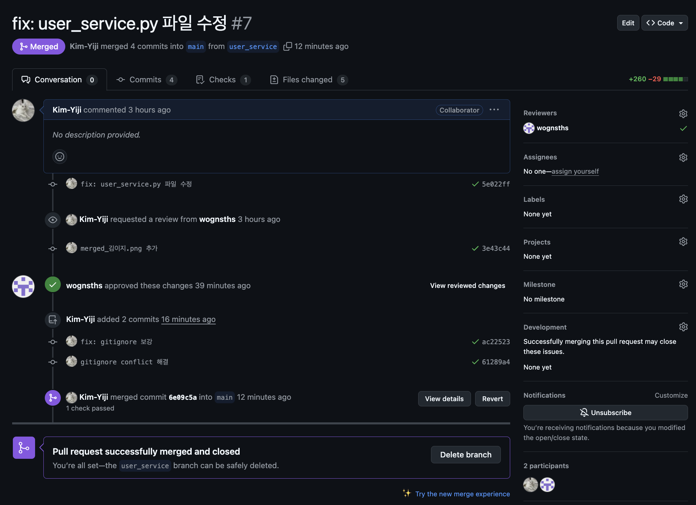

# YBIGTA_newbie_team_project

## 팀소개
안녕하세요! 6조입니다!!! 화이팅화이팅~~

## 팀원 소개

| **손재훈(조장)**          | **김이지**                   | **신소연**              |
|:-------------------------:|:---------------------------:|:-----------------------:|
| 00년생 응용통계학과 21학번 | 01년생 컴퓨터과학과 20학번 | |
| 반갑습니다! 잘 부탁드립니다~ | 잘 부탁드립니다! |  |

## 사진

#### branch_protection.png

#### push_rejected.png

#### merged_손재훈.png

#### merged_김이지.png

#### merged_신소연.png

## app 프로젝트 실행 방법

1. 가장 상위 폴더 디렉토리로 이동
2. 필요한 라이브러리 설치 : pip install -r requirements.txt 
3. 실행 : uvicorn app.main:app --reload
4. 웹 브라우저를 켜서 : http://127.0.0.1:8000/static/index.html
5. 기능 살펴보기

## crawling 데이터 정보

#### 영화 : 기생충
1. 네이버 영화 리뷰(국내)
    - 크롤링한 사이트의 링크 : "https://search.naver.com/search.naver?query=영화%20기생충%20관람평"
    - columns(데이터 형식) : review_type(str), sort_type(str), writing_date(str), star_rating(str), comment(str), upvote(int), downvote(int)
    - 개수 : 1092개

2. IMDB 영화 리뷰(해외)
    - 크롤링한 사이트의 링크 : "https://www.imdb.com/title/tt6751668/reviews/?ref_=tt_ururv_sm"
        - 스포일러 리뷰는 모두 제거하고 가져옴
    - columns(데이터 형식) : star_rating(int),title(str),content(str),date(str)의 컬럼으로 구성됨
    - 개수 : 2977개

## crawling code 실행 방법
1. 터미널 위치를 crawling 폴더로 이동
2. python main.py -o ../../database --all

## EDA

1. 분포 파악
   - 네이버와 IMDB 리뷰의 평점 분포 파악
   
   - 텍스트 길이 분포 파악
   - 날짜 분포 파악
   
2. 이상치 파악
   - 별점 범위 벗어난 값
   - 비정상적으로 길거나 짧은 리뷰
   - 기간 이상치 파악

## 데이터 전처리/FE

1. 네이버 영화 리뷰
   - 결측치 처리
   - 이상치 처리
   - 텍스트 데이터 전처리
   - 파생 변수 1가지 이상 생성
   - 텍스트 벡터화

2. IMDB 영화 리뷰
    - 결측치 처리
   - 이상치 처리
   - 텍스트 데이터 전처리
   - 파생 변수 1가지 이상 생성
   - 텍스트 벡터화

## 시각화
(비교분석 그래프에 대한 그래프와 설명)

### 텍스트 비교 분석

1. 네이버 영화 리뷰
   - 평점 5 이상의 리뷰에 대한 텍스트 빈도

   - 평점 5 이하의 리뷰에 대한 텍스트 빈도

    - 전체 평점에 대한 텍스트 빈도

    - 자주 등장하는 키워드에 대한 평점 분포

2. IMDB 영화 리뷰
    - 평점 5 이상의 리뷰에 대한 텍스트 빈도

    - 평점 5 이하의 리뷰에 대한 텍스트 빈도

    - 전체 평점에 대한 텍스트 빈도

### 시계열 분석
- 두 사이트의 모든 데이터를 통합한 데이터에 대한 시간별 평점 추이

## preprocessing code 실행 방법
1. 터미널 위치를 crawling 폴더로 이동
2. python main.py -o ../../database --all

